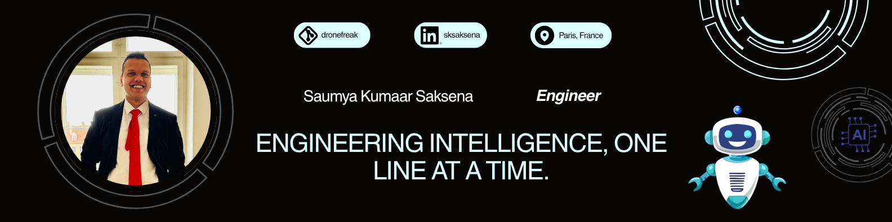

  <h2>Hare Krishna! I'm Saumya 🙏</h2>
  

### 🚀 &nbsp;About Me

- 5+ years building **computer vision** and **deep learning** systems across **autonomous mobility**, **healthcare**, and **AR/VR** — currently in Paris on safety-critical perception for self-driving shuttles
- Hands-on with **edge optimization** and **model quantization** for **low-power embedded devices**, from training to on-device validation

### 🛠 &nbsp;Tech Stack

| Category | Stack |
|---|---|
| **Languages & Robotics** |      |
| **ML / AI** |         |
| **DevOps & Collaboration** |        |
| **Editors & Tools** |      |

### ⚙️ &nbsp;GitHub Analytics

  <picture>
    <source media="(prefers-color-scheme: dark)" srcset="https://raw.githubusercontent.com/dronefreak/dronefreak/output/github-contribution-grid-snake-dark.svg" />
    <source media="(prefers-color-scheme: light)" srcset="https://raw.githubusercontent.com/dronefreak/dronefreak/output/github-contribution-grid-snake.svg" />
    
  </picture>

### 🤝🏻 &nbsp;Social Profiles

  
  &nbsp;&nbsp;&nbsp;
  
  &nbsp;&nbsp;&nbsp;
  

